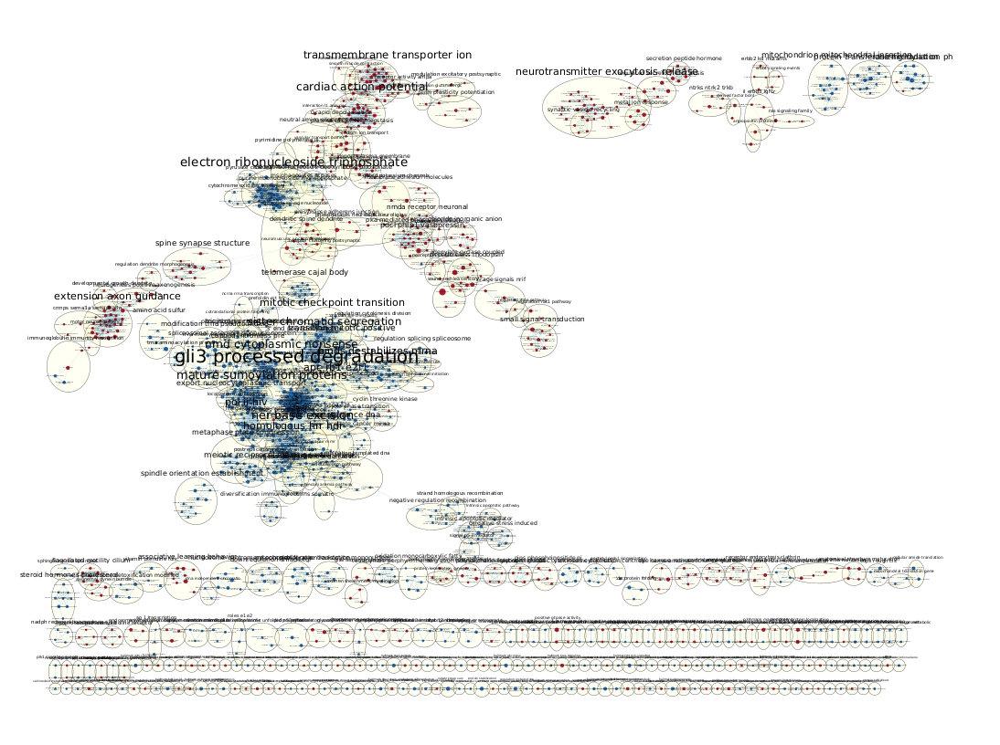

```{r test-main,eval=FALSE,  child = './assignment2/assignment2.Rmd'}
#Unforunately the child document failed to compile together with the analysis, and it didn't produce an error (just took an abnormal amount of time until I stopped rendering, and relatively it rendered quickly).
```

```{r initData, warning=FALSE, message=FALSE, results='hide'}
# change this to TRUE if running local, FALSE will not download gmt files from bader lab nor perform the GSEA analysis
runningLocal <- FALSE

# Getting the data from GEO
datasetName <- 'GSE125664'
suppFiles <- GEOquery::getGEOSuppFiles(datasetName)
fileNames <- rownames(suppFiles)
expressionDF <- read.delim(fileNames[1], header=TRUE,
check.names = FALSE, sep = ',')
colnames(expressionDF)[1] <- "HGNC_SYM"
#Remove the duplicates - for some reason this doesn't work for MARCHF1/2 gene (1-Mar and 2-Mar)
expressionDF <- expressionDF[rownames(expressionDF) == unique(rownames(expressionDF)),]
# Naming treatments and samples
groups <- data.frame(lapply(colnames(expressionDF)[-1],
FUN=function(x){unlist(strsplit(x, split = '_neurons_'))}))
colnames(groups) <- colnames(expressionDF)[-1]
rownames(groups) <- c('CellType', 'Sample')
samples <- data.frame(t(groups))

#Change the initial DF colnames to group names, more tidy and easily understood (for me), format is TREATMENT.SAMPLE
colnames(expressionDF)[-1] <- paste(samples$CellType, samples$Sample, sep = '.')

#Removing low-count expressed genes from data
cpms = edgeR::cpm(expressionDF[,-1])
rownames(cpms) <- expressionDF$gName
keep = rowSums(cpms >1) >=3
expFiltered = expressionDF[keep,]

#Normalizing data
matFiltered <- as.matrix(expFiltered[,-1])
rownames(matFiltered) <- expFiltered[,1]
d <- edgeR::DGEList(counts = matFiltered, group = samples$CellType)
d <- edgeR::calcNormFactors(d)
normalizedCounts <- edgeR::cpm(d)
```

```{r downloadPathwayData, warning=FALSE, message=FALSE}
if (runningLocal) {
  gmt_url = "http://download.baderlab.org/EM_Genesets/current_release/Human/symbol/"
# list all the files on the server
  
  filenames = RCurl::getURL(gmt_url)
  tc = textConnection(filenames)
  contents = readLines(tc)
  close(tc)
  # get the gmt that has all the pathways and does not include terms inferred
  # from electronic annotations(IEA) start with gmt file that has pathways only
  rx = gregexpr("(?<=<a href=\")(.*.GOBP_AllPathways_no_GO_iea.*.)(.gmt)(?=\">)", contents,perl = TRUE)
  gmt_file = unlist(regmatches(contents, rx))
  
  dest_gmt_file <- file.path(getwd(), gmt_file)
  download.file(paste(gmt_url, gmt_file, sep = ""), destfile = dest_gmt_file)
}
```

```{r geneNameFix}
#As was mentioned in the previous assignment, some names were automatically converted to a date format. Here we fix this. There are only for MARCHF1-9 and SEPTIN1-15, not all of them are here. Also fix a duplicate issue without its removal.
dateNames <- strsplit(rownames(normalizedCounts)[grep(pattern = "^[0-9]", rownames(normalizedCounts))], split = '-')
fixedNames <- character(length(dateNames))
for (i in 1:length(dateNames)) {
  dNum <- dateNames[[i]][1]
  dName <- dateNames[[i]][2]
  if (dName == "Mar") {
    fixedNames[i] <- paste('MARCHF', dNum, sep = '')
  }
  else if (dName == "Sep") {
    fixedNames[i] <- paste('SEPTIN', dNum, sep = '')
  }
}
#slightly modify the duplicates in this
fixedNames[duplicated(fixedNames)] <- paste(fixedNames[duplicated(fixedNames)], '(duplicate)')
#Put them back in
rownames(normalizedCounts)[grep(pattern = "^[0-9]", rownames(normalizedCounts))] <- fixedNames

#non exhaustive list of some of the serotonin receptors
serotoninReceptors <- normalizedCounts[grep('^HTR', rownames(normalizedCounts)),]
```
```{r splittingData_HvNR}
HvNR <- normalizedCounts[,1:6]
trt_model1 <- model.matrix(~samples$CellType[1:6])

expMatrix <- as.matrix(HvNR)
rownames(expMatrix) <- rownames(HvNR)
colnames(expMatrix) <- colnames(HvNR)

eSet <- Biobase::ExpressionSet(assayData = expMatrix)

fit_1 <- limma::lmFit(eSet, design = trt_model1)
fit2_1 <- limma::eBayes(fit_1, trend = TRUE)

topHvNRfit <- limma::topTable(fit2_1,
                          coef = ncol(trt_model1),
                          adjust.method = "BH",
                          number = nrow(expMatrix))
topHvNRfit <- topHvNRfit[order(topHvNRfit$P.Value),]

sigGenesHvNR <- topHvNRfit[topHvNRfit$P.Value<0.05,]
sigGeneCountHvNR <- nrow(topHvNRfit[topHvNRfit$P.Value<0.05,])
```

```{r splittingData_HvR}
HvR <- normalizedCounts[,c(1,2,3,7,8,9)]
trt_model2 <- model.matrix(~samples$CellType[c(1,2,3,7,8,9)])

expMatrix <- as.matrix(HvR)
rownames(expMatrix) <- rownames(HvR)
colnames(expMatrix) <- colnames(HvR)

eSet <- Biobase::ExpressionSet(assayData = expMatrix)

fit_2 <- limma::lmFit(eSet, design = trt_model2)
fit2_2 <- limma::eBayes(fit_2, trend = TRUE)

topHvRfit <- limma::topTable(fit2_2,
                          coef = ncol(trt_model2),
                          adjust.method = "BH",
                          number = nrow(expMatrix))
topHvRfit <- topHvRfit[order(topHvRfit$P.Value),]

sigGenesHvR <- topHvRfit[topHvRfit$P.Value<0.05,]
sigGeneCountHvR <- nrow(topHvRfit[topHvRfit$P.Value<0.05,])
```

```{r splittingData_NRvR}
NRvR <- normalizedCounts[,4:9]
trt_model3 <- model.matrix(~samples$CellType[4:9])

expMatrix <- as.matrix(NRvR)
rownames(expMatrix) <- rownames(NRvR)
colnames(expMatrix) <- colnames(NRvR)

eSet <- Biobase::ExpressionSet(assayData = expMatrix)

fit_3 <- limma::lmFit(eSet, design = trt_model3)
fit2_3 <- limma::eBayes(fit_3, trend = TRUE)

topNRvRfit <- limma::topTable(fit2_3,
                          coef = ncol(trt_model3),
                          adjust.method = "BH",
                          number = nrow(expMatrix))
topNRvRfit <- topNRvRfit[order(topNRvRfit$P.Value),]
sigGenesNRvR <- topNRvRfit[topNRvRfit$P.Value<0.05,]
sigGeneCountNRvR <- nrow(topNRvRfit[topNRvRfit$P.Value<0.05,])
```

```{r rankingGenes}
# convert the significance to an number using -log10, and this makes it more significant the higher the result. This allows us to multiply it with the fold change value to see  contributions from both related expression and statistical significance.
topHvNRfit[,"rank"] <- (-log10(topHvNRfit$P.Value
))*sign(topHvNRfit$logFC)
topHvNRfit <- topHvNRfit[order(topHvNRfit$rank),]
write(rbind("gene\trank",paste0(paste0(rownames(topHvNRfit), "\t"), topHvNRfit$rank, collapse = "\n")), file = "./a3supplementary/rankHvNR.rnk")


topHvRfit[,"rank"] <- (-log10(topHvRfit$P.Value
))*sign(topHvRfit$logFC)
topHvRfit <- topHvRfit[order(topHvRfit$rank),]
write(rbind("gene\trank",paste0(paste0(rownames(topHvRfit), "\t"), topHvRfit$rank, collapse = "\n")), file = "./a3supplementary/rankHvR.rnk")


topNRvRfit[,"rank"] <- (-log10(topNRvRfit$P.Value
))*sign(topNRvRfit$logFC)
topNRvRfit <- topNRvRfit[order(topNRvRfit$rank),]
write(rbind("gene\trank",paste0(paste0(rownames(topNRvRfit), "\t"), topNRvRfit$rank, collapse = "\n")), file = "./a3supplementary/rankNRvR.rnk")
```

## Introduction

The GEO dataset `r datasetName` is an RNA-seq data that has three treatments of differentiated IPSCs from patients with differing conditions. The three treatments are as follows: healthy (H), patients with Major Depressive Disorder (MDD) and respond to SSRI antidepressants (Remittant - R), and patients with MDD that are resistant to SSRI treatment (Non-Remittant - NR). The data was pulled from GEO and normalized using the edgeR package. Later, the differentially expressed genes of the normalized data was calculated using a thresholded method where p < 0.05 was the cutoff. Now, for a more detailed and thorough analysis a non-thresholded analysis and gene set enrichment is performed.

## Non-thresholded Gene set Analysis

```{r GSEAanalysis, message=FALSE, warning=FALSE, results = 'hide'}
gsea_jar <- "GSEA_Linux_4.2.3/gsea-cli.sh" #this ~must be confirmed if runningLocal is TRUE
rnkFile <- c("a3supplementary/rankHvNR.rnk", "a3supplementary/rankHvR.rnk", "a3supplementary/rankNRvR.rnk")
analysisName <- c("analysis_HvNR", "analysis_HvR", "analysis_NRvR")
outName <- c("gseaHvNR.txt", "gseaHvR.txt", "gseaNRvR.txt")
if (runningLocal) {
  for (i in 1:length(analysisName)) {
    system(paste('mkdir', analysisName[i]))
    command <- paste("", file.path(getwd(), gsea_jar), "GSEAPreranked -gmx", dest_gmt_file, "-collapse No_Collapse -mode Abs_max_of_probes -norm meandiv -nperm 1000 -rnd_seed timestamp -rnk", file.path(getwd(), rnkFile[i]), "-scoring_scheme weighted -rpt_label", analysisName[i], "-plot_top_x 20 -set_max 200 -set_min 15 -zip_report false -out", file.path(getwd(), analysisName[i]), sep = " ")
    system(command)
  }
}
```

#### What method did you use? What genesets did you use? 

For the non-thresholded gene set enrichment analysis, the standalone java program GSEA was used [@gseaREF]. The gene sets that were used for this analysis was pulled automatically from the Balder lab repository where the data is periodically updated (The version used in this report is of April 1st) [@enrichmentmapREF].

^[Note: I spent considerable time on GSVA [@gsvaREF] and EGSEA [@egseaREF], but the input output formats and generally the whole analysis was very difficult to understand the control of it. I gave up and opted-out for GSEA, which is very beginner-friendly.]

#### Summarize your enrichment results

In general, the enrichment results had much more significant gene sets that were associated with the differentially expressed genes. This stems from the fact that genes that don't make through the threshold cut-off still contribute to the overall enrichment score (ES). This ES, in turn, reflects the representation of gene sets in a given differential expression dataframe. Three different GSEA were performed: HvR, HvNR, and NRvR; where H is the healthy cell line, R is the remittant (SSRI-responsive), and NR is the non-remittant (SSRI-responsive). Both HvR and HvNR analyses resulted in many gene set enrichments related to neuronal gene sets. NRvR had much fewer enriched gene sets, most probably due to their phenotype only differing in their responsiveness to SSRI medication to treat MDD.

#### How do these results compare to the results from the thresholded analysis in Assignment #2. Compare qualitatively. Is this a straight forward comparison? Why or why not?

To compare qualitatively thresholded and non-thresholded analyses, HvNR group was chosen since the last report had the g:profiler manhattan plot displayed for that group [@gprofilerREF]. Of note, 22 GO biological process was found to be significant by the g:profiler search. In comparison, 1453 gene sets were found to be enriched in the non-thresholded gene set analysis. When these gene sets were clustered using the tool AutoAnnotate, there were 480 clusters formed of these gene sets[@autoannotateREF]. It is hard to do a quantitative comparison, since it is not known if the extra information in the non-thresholded analysis is relevant or not, given that the SSRI-resistance in MDD is not well-characterized. Additionally, the non-thresholded analysis produced more than GO biological processes, meaning comparing them in a quantitative manner is not straight forward. In conclusion, non-thresholded analysis was superior in the quantity of information that was returned, given that the significant hits in the thresholded analysis forms a sub-space of the non-thresholded analysis search space.

## Cytoscape Visualization

The enrichment results were carried on to Cytoscape to be visualized using the Enrichment Map application [@cytoscapeREF; @enrichmentmapREF] 

#### Pre-annotation graphs

For all three different groupments, the thresholds used were the same. The edge-cutoff values were adjusted later on to preserve connectedness between major related themes (e.g. synaptic excitation and neurotransmitter-response).

```{r preAnnNetworks_all, out.width="33%", out.height="20%",fig.show='hold', fig.cap="Figure 1: All of the networks unedited. From left to right: Healthy against SSRI-responsive, Healthy against SSRI-resistant, SSRI-resistant against SSRI-responsive"}
knitr::include_graphics(c("./a3supplementary/unedited_HvR.png", "./a3supplementary/unedited_HvNR.png", "./a3supplementary/unedited_NRvR.png"))
```

#### IPSC-related gene set cluster

One of the most common and spread out cluster of clusters were that of cancer-related pathways. This was due to the accumulation of differentially down-regulated genes in the samples. The major presence of the cancer-related pathways and gene sets are visible in the figure below. This finding was completely attributed to a false positive given that the research design included differentiated neurons which were initially grafted from skin cells to be induced into pluripotent stem cells. 

```{r, fig.align='center', fig.cap='Figure 2: Network of the HvR group with the cancer-related pathways highlighted.'}

```


#### AutoAnnotate clusters

The application AutoAnnotate in Cytoscape was used to automatically annotate major themes in the underlying gene sets that were clustered. Unfortunately, this resulted in hard-to-understand themes, as shown in the figure below, and manual annotation was conducted for each of the maps thereafter.

```{r autoAnnotatedNetworks, fig.cap="Figure 3: Networks produced with the AutoAnnotate App in Cytoscape. From top to bottom: Healthy against SSRI-responsive, Healthy against SSRI-resistant, SSRI-resistant against SSRI-responsive"}

knitr::include_graphics("./a3supplementary/autoAnnotate_HvNR.png")

```


#### Main Figures

```{r mainFigures_HvR, fig.align='center', fig.cap= "Figure 4: Manually annotated network of the enrichment map produced by healthy against SSRI-responsive. Of note, glutamic acid is at the centre of the neurotransmitters, interacting with a lot of neurological pathways."}

```

```{r mainFigures_HvNR, fig.align='center', fig.cap= "Figure 5: Manually annotated network of the enrichment map produced by healthy against SSRI-resistant. Of note, glutamic acid is at the centre of the neurotransmitters, interacting with a lot of neurological pathways."}

```

```{r mainFigures_NRvR, fig.align='center', fig.cap= "Figure 6: Manually annotated network of the enrichment map produced by SSRI-resistant against SSRI-responsive. Here, glutamic acid does not target gene sets as significantly, compared to the other two treatments."}

```

```{r legends_Figs, fig.align='center', fig.cap='Legends of the figures 4, 5, 6'}

```


## Interpretation

#### Do the enrichment results support conclusions or mechanism discussed in the original paper? How do these results differ from the results you got from Assignment #2 thresholded methods?

The authors showed in their study that the SSRI-resistant neurons were hyper-reactive in response to SSRI stimulation. These enrichment results support the claims of the authors, visible in Figure 5 and 6, where calcium related gene sets are enriched. Additionally, many other pathways can be seen in all of the figures that are related to synaptic biology.

#### Can you find evidence, i.e. publications, to support some of the results that you see. How does this evidence support your result?

Other publications and supporting evidence are discussed below to remain non-redundant and coherent.

### Post-analysis

For post-analysis, drug interactions from drugbank database were used. The reasoning behind this was to see if the hyperactivity found in the original paper could be correlated to any of the genesets in the GSEA [@mainREF]. In the NRvR group, all of the small molecules that passed significane values were included, whereas for the HvR and HvNR groups, two representative drugs from the most popular MDD treatments were used in the signature dataset, regardless of their significance. The most commonly used antidepressants are as follows:

* Selective Serotonin Reuptake Inhibitors (SSRIs)
  * Citalopram
  * Escitalopram
* Serotonin-Norepinephrine Reuptake Inhibitors (SNRIs)
  * Desvenlafaxine
  * Duloxetine
* Tricyclic Antidepressants (TCAs)
  * Amitryptiline
  * Clomipramine
* Monoamine Oxidase Inhibitors (MAOIs)
  * Isocarboxazid
  * Phenelzine
* Ketamine and derivatives
  * Ketamine
  * Esketamine
* Atypical 
  * Bupropion
  * Buspirone
^[As ketamine is recently gaining attention to be a potent and effective antidepressant, ketamine and esketamine were included in the signature analysis]

In the paper by Vadodaria et al., the authors probe the molecular basis of SSRI-resistance in Major Depressive Disorder (MDD) treatment [@mainREF]. While SSRIs are the most common antidepressant prescribed today, Treatment Resistant Depression (TRD) is a represents a wider coverage in treating the depression episodes of MDD. Although the exact definition is still elusive, the authors show physiological and biochemical differences in resistant and responsive cell cultures, such as hyper-reactivity to SSRI stimulus.

TRD was first diagnosed via meta-analyses when tricyclic antidepressants (TCA) were common, and supporting evidence was found when it was evaluated with SSRIs in focus [@philip2010]. Now, TRD treatment has been generalized and consists of four main categories, or a combination of these four depending on the patients needs: optimization, switching, augmentation, non-pharmaceutical approaches like therapy [@shelton2010]. Optimization is utilized when the patient is not receiving the dosage required for symptoms to retreat, and is often the first approach. Switching consists of either in-class (e.g. SSRI to SSRI) or between-class (e.g. SSRI to MAOI) switching of medication. Finally, augmentation is considered as when the main antidepressant is supplemented with an atypical antidepressant such as lithium citrate.

Following this, we can see in Figs. 4, 5, 6 that there are a lot of similarities and differences in the targets of the antidepressants, especially when different classes of drugs are compared. Interesting implication of the lack of pathways in Figure 6 supports that MDD biological profiles show similarly differentially regulated genes, and differ on a smaller scale to produce significant results when compared to each other. The most obvious conclusion is that since TRD exists as an umbrella term, case-by-case treatment of patients would be the optimal approach to treating MDD.

Of interest, ketamine (or its active metabolite esketamine) was significant in all of the enriched gene sets regarding its interaction. A growing body of evidence is showing that it is a promising candidate for treatment of MDD and similar mental health disorders through inhibition of glutamatergic receptors by NMDA and mGlu5 antagonists [@borbely2022; @berman2000]. This connects well with the previous hypothesis on this project that glutamatergic GPCRs dimerize with 5-HT (serotonin) receptors and have known cross-talk pathways.

Moreover, it can be hypothesized that MDD on a molecular basis can be a cancer-like disorder, where the end phenotype is clustered together due to "truncal defects/mutations", but differ widely and significantly in the molecular signature for each patient. This stems from the fact that MDD treatment have polarized effects where some patients don't respond well to some drugs but can have total remission of episodes by other combination of treatments. 

In conclusion, diagnosing the underlying molecular basis of MDD remains elusive, but as other treatment options that have greater impact in symptom remissions get adopted, the identification of the cause of a complex disease can be dismantled by the gene targets and interactions of these selective drugs.


## References
